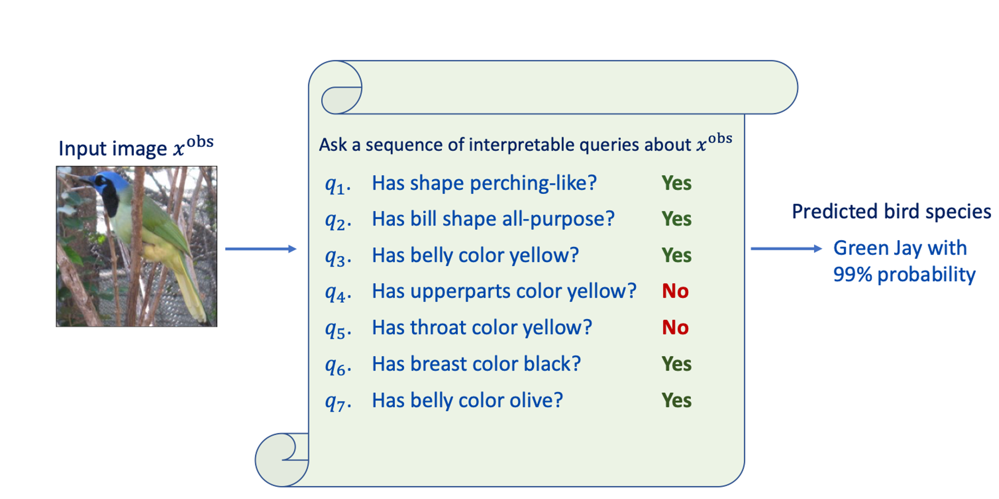

# Generative Information Pursuit

**Aditya Chattopadhyay<sup>1</sup>, Stewart Slocum, Benjamin D. Haeffele; René Vidal and Donald Geman** <br>

**¹Johns Hopkins University, USA, `achatto1 <at> jhu.edu`**

Official code to accompany the paper [Interpretable by design: Learning predictors by composing interpretable queries(TPAMI 2022)](https://ieeexplore.ieee.org/abstract/document/9964439).

## Overview
<p align="center">

</p>

There is a growing concern about typically opaque decision-making with high-performance machine learning algorithms. Providing an explanation of the reasoning process in domain-specific terms can be crucial for adoption in risk-sensitive domains such as healthcare. We argue that machine learning algorithms should be interpretable by design and that the language in which these interpretations are expressed should be domain- and task-dependent. Consequently, we base our model's prediction on a family of user-defined and task-specific binary functions of the data, each having a clear interpretation to the end-user. We then minimize the expected number of queries needed for accurate prediction on any given input. As the solution is generally intractable, following prior work, we choose the queries sequentially based on information gain. However, in contrast to previous work, we need not assume the queries are conditionally independent. Instead, we leverage a stochastic generative model (VAE) and an MCMC algorithm (Unadjusted Langevin) to select the most informative query about the input based on previous query-answers. This enables the online determination of a query chain of whatever depth is required to resolve prediction ambiguities. Finally, experiments on vision and NLP tasks demonstrate the efficacy of our approach and its superiority over post-hoc explanations.


## Requirements
This project uses the `conda` package manager. Currently we only support Linux environments.
On Linux, type
```
conda env create -f environment.yml
```
Once this command has finished, you can activate the environment with `conda activate`.
 
We also use `wandb` to moderate training and testing performance. One may remove lines related to `wandb` and switch to other packages if they desire. 

## Datasets
This code supports 5 datasets: mnist, kmnist, fashion_mnist, caltech_silhouttes, cub

For CUB-200 (cub), please download the dataset from https://www.vision.caltech.edu/datasets/cub_200_2011/. Remember to save the dataset at "./data/CUB/", with the image directory being located at "./data/CUB/CUB_200_2011".

## Code
Following are list of relevant codes.

1. **train.py**: code to train the VAE generative model for learning the distribution between the query answers and labels. Usage:
   python train.py <dataset_name> 
2. **run_ip.py**: code to run the IP algorithm using the trained VAE generative model. Usage:
   python run_ip.py

   Here the dataset_name is an argument in the code that needs to be changed 

## License
This project is under the MIT License. See [LICENSE](./LISENSE.md) for details.


## Cite
If you find our work useful for your research, please cite:

```
@article{chattopadhyay2022interpretable,
  title={Interpretable by design: Learning predictors by composing interpretable queries},
  author={Chattopadhyay, Aditya and Slocum, Stewart and Haeffele, Benjamin D and Vidal, Rene and Geman, Donald},
  journal={IEEE Transactions on Pattern Analysis and Machine Intelligence},
  volume={45},
  number={6},
  pages={7430--7443},
  year={2022},
  publisher={IEEE}
}
